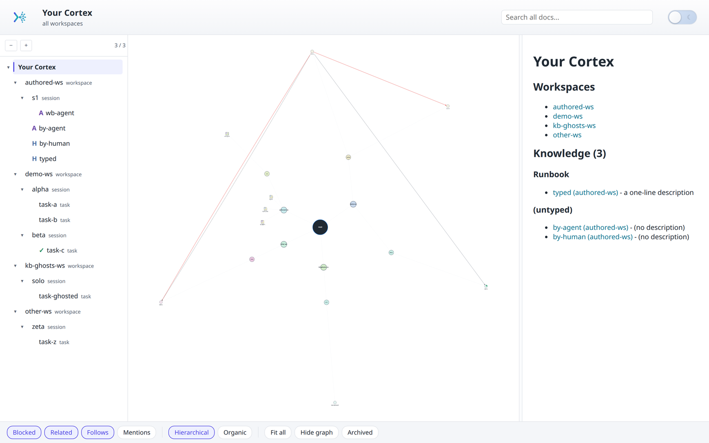
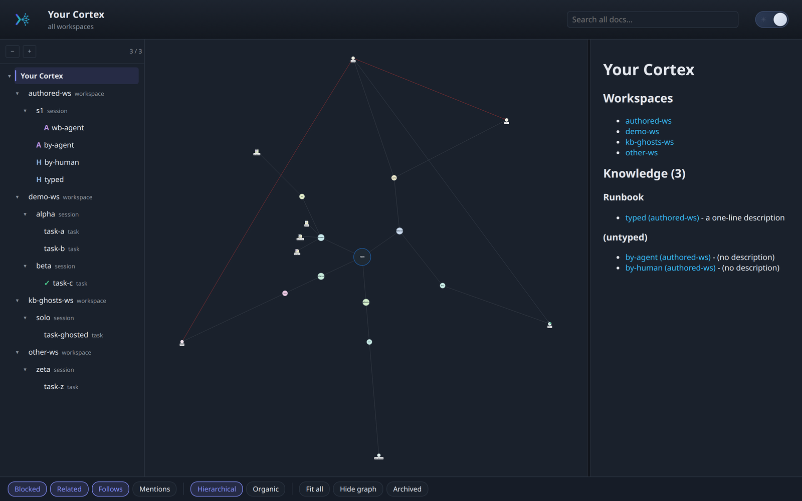

<p align="center">
  
</p>

# cortex

Portable bundle of file-based work-tracking skills for AI coding agents. Designed to work with any harness that reads `SKILL.md` from a skills directory: Claude Code, Codex, Copilot CLI, Gemini CLI.

One CLI fronts the whole family: **`cortex`**. Its verbs are `cortex kb` (author knowledge), `cortex viz` (visualize), `cortex query neighbors <slug>` (explore a doc's links), `cortex inject` (opt-in session-start injection), `cortex sync` (cross-device sync of the store), and `cortex migrate-store` (move a legacy `~/.work` store to `~/.cortex`). Every verb runs through one self-contained `cortex` Python package (`cortex/`); the former per-skill bash/Python CLIs have been retired.

## The dashboard

`cortex viz` builds a static, browser-based view of every workspace, session, and task: a collapsible tree, a hub-and-spoke graph of typed links, and a rendered-markdown content pane. Read-only by default; theme-aware (light + dark).

**Light theme**

<p align="center">
  
</p>

**Dark theme**

<p align="center">
  
</p>

## Skills in this repo

| Skill | Purpose |
|---|---|
| `cortex-tracking` | Main skill — file-based session/task tracking across workspaces, with global + local stores and concurrent-agent support. |
| `cortex-github` | Optional PR/commit drift detection via the `gh` CLI, invoked by the main skill when a session has `github:` frontmatter. |
| `cortex-migration` | Move a session between the global store (`~/.cortex/`) and a repo-local store. |
| `cortex-sync` | Optional cross-device sync of `~/.cortex/` via a private GitHub repo. See `skills/cortex-sync/docs/` for design. |
| `cortex-viz` | Browser-based viewer for `~/.cortex/`: three-pane tree + Cytoscape graph + rendered markdown, plus a cross-workspace dashboard. Ships a `cortex viz` CLI with one-shot, `--watch`, `serve`, and `--workspace=all` modes. |
| `cortex-kb` | Author and bulk-ingest knowledge/workbench docs (`cortex kb` CLI): structured frontmatter, a pull-based index, and codebase ingestion. Rendered by `cortex-viz`, replicated by `cortex-sync`. |
| `cortex-inject` | Optional, off-by-default session-start context injection (`cortex inject` CLI). The single exception to the otherwise pull-based, no-auto-injection design. |

## Knowledge base

Beyond sessions and tasks, a workspace can hold durable notes. `cortex-kb`
(the `cortex kb` CLI) owns writing them:

- **Two document classes.** `knowledge/<slug>.md` is workspace-scoped (context
  shared across tasks); `workbench/<slug>.md` is session-scoped (drafts, spec /
  plan / brainstorm output).
- **Structured frontmatter.** Optional `title`, `type`, `description`, plus
  auto-maintained `author` / `created` / `updated`. `type` is a documented,
  evolvable convention (`Decision`, `Design`, `Reference`, `Runbook`,
  `Investigation`, `Convention`, `Comparison`; custom values allowed).
- **`cortex kb new` / `cortex kb update`.** Create-only vs modify-only (field merge
  and a pure `updated`-bump touch).
- **`cortex kb index`.** A compact, pull-based table of contents so agents can see
  what already exists before authoring a duplicate. Prints to stdout, or
  `--write` regenerates a derived `knowledge/INDEX.md` (like `SUMMARY.md`, never
  hand-maintained, never injected).
- **The brain (cross-workspace).** `cortex kb index --workspace=all` aggregates
  every global workspace's knowledge into one dictionary grouped by type; the
  viz root page renders the same data as a wiki whose concepts link across
  workspaces. Derived and regenerable, never hand-authored. Scope is the global
  store (`~/.cortex/workspaces/*`); repo-local `.cortex` stores are not included.
- **`cortex kb ingest`.** Bulk-ingest a codebase into a workspace's `knowledge/`:
  a deterministic path documents OpenAPI/Swagger and SQL DDL, and everything
  fuzzier (Prisma, README `## API` / `## Schema` sections, runbooks, model dirs)
  is surfaced as an agent worklist. Dry-run by default; `--write` is the gate;
  existing docs are never overwritten. `--from <src>` names the codebase to read,
  `--workspace <dest>` the KB to write.

### How the skills connect

- `cortex kb` **writes** knowledge/workbench docs; `cortex-viz` **renders**
  them (tree, graph, content, with the frontmatter fields above); and
  `cortex-sync` **replicates** the whole `~/.cortex/` store. All three
  share one file layout and the same `cortex sync push` hook.
- The main `cortex-tracking` skill invokes `cortex-kb` at its knowledge
  checkpoints (capturing durable notes, resolving `[[knowledge/...]]` ghost
  links, recording spec/plan output).
- `cortex kb ingest` reads a codebase and writes into a KB workspace. It is
  unrelated to `cortex-migration`, which **moves a session** between the
  global and local stores. Different verbs, opposite direction, different data.

## Install

### Quickest path: one-liner

```bash
curl -fsSL https://raw.githubusercontent.com/FredDsR/cortex/main/bootstrap.sh | bash
```

`bootstrap.sh` clones the repo to `~/cortex` and then runs `install.sh` from it.
Re-running the same command updates an existing checkout instead of cloning
again. Set `CORTEX_DIR` to clone elsewhere, and pass `install.sh` flags through
with `bash -s --`:

```bash
curl -fsSL .../bootstrap.sh | CORTEX_DIR=~/src/cortex bash
curl -fsSL .../bootstrap.sh | bash -s -- --project ~/some-repo
```

If `~/cortex` already exists and is not a cortex checkout, the script stops
rather than writing over it.

Note that piping `install.sh` itself will not work. It symlinks *into* the repo,
so the repo has to exist on disk first; that is the whole job `bootstrap.sh`
does before handing off.

### Primary path — symlink install (any harness)

Clone anywhere, then run `install.sh`. It detects which agent harnesses you have on this device (by probing `~/.claude/`, `~/.codex/`, `~/.copilot/`, `~/.gemini/`) and symlinks each skill into their respective `skills/` directories.

```bash
git clone git@github.com:FredDsR/cortex.git ~/cortex
bash ~/cortex/install.sh
```

Put the clone anywhere you like — `install.sh` uses its own directory as the source, so symlinks will always point at wherever you cloned.

### Global vs project-scoped

Agents support skills at two scopes:
- **Global**: `$HOME/.<harness>/skills/<name>/` — visible to every project.
- **Project**: `<repo>/.<harness>/skills/<name>/` — visible only when the agent is run from that project.

`install.sh` supports both:

```bash
# Global (default) — all your agent sessions see these skills
bash install.sh

# Project-scoped — only this repo's agent sessions see them
cd ~/some-repo
bash /path/to/cortex/install.sh --project            # defaults to $PWD
bash /path/to/cortex/install.sh --project ~/some-repo  # or explicit path
```

Project-scoped install creates `<repo>/.claude/skills/`, `<repo>/.codex/skills/`, etc. as needed (but only for harnesses you already use globally, detected via presence of `$HOME/.<harness>/`). Re-run after `git pull` in the skills clone to refresh.

### Alternate path — Claude Code `/plugin` (experimental)

A `.claude-plugin/marketplace.json` + `plugin.json` are included so this repo is also addable as a Claude Code plugin marketplace:

```
/plugin marketplace add FredDsR/cortex
/plugin install cortex
```

Note: some cross-skill invocations in the main skill hardcode `$HOME/.claude/skills/<sub-skill>/...` paths, so the symlink path is the first-class install. The plugin route is provided as a convenience for Claude-Code-only users who prefer the `/plugin` UX; behavior is best-effort.

## Update

Because `install.sh` symlinks each skill into the harness directories, a single
`git pull` in this clone is enough for content changes; you only need to re-run
`install.sh` when a new skill folder appears, a new harness is detected, or
vendored assets need refreshing.

The bundled `update-skills.sh` does both in one shot, fails fast on uncommitted
changes, and prints which commits arrived:

```bash
bash <wherever-you-cloned-it>/update-skills.sh
```

It forwards extra arguments to `install.sh`, so project-scoped updates work the
same way:

```bash
bash <wherever-you-cloned-it>/update-skills.sh --project ~/some-repo
```

Or do it manually:

```bash
cd <wherever-you-cloned-it>
git pull
bash install.sh   # only if a new skill / harness / vendor asset
```

## Uninstall

`uninstall.sh` is the counterpart to `install.sh` and removes everything the
installer created: the skill symlinks in each harness, the `close-day` slash
command, and `~/.cortex/bin/cortex`. If the session-start hook is wired, it is
unwired first, so nothing is left pointing at a deleted binary.

```bash
bash uninstall.sh              # global
bash uninstall.sh --dry-run    # show what would go, change nothing
bash uninstall.sh --project    # remove a project-scoped install
```

| Flag | Effect |
|------|--------|
| `--project [path]` | Remove a project-scoped install (defaults to `$PWD`) |
| `--dry-run` | Print every action; change nothing |
| `--purge-store` | **Also delete your work data** in `~/.cortex/`. Requires typed confirmation |
| `--yes` | Skip that confirmation. Refused without sync unless passed twice |

**Your work data is never touched without `--purge-store`.** The default run
leaves `~/.cortex/workspaces/`, `archive/`, and `knowledge/` exactly as they
were, and says so on the way out.

Only symlinks pointing into this repo are removed. A real directory, or a
symlink into a different checkout, is reported and left alone. That means a
second cortex install survives, and so does any `.bak` directory the installer
set aside.
Removing the `PATH` line from your shell rc is the one manual step left.

## Opt-in session-start injection

Off by default. `cortex inject enable --wire-hook claude-code` wires a Claude
Code `SessionStart` hook that injects the active workspace's knowledge index,
workbench, and open tasks at session start. Per-workspace opt-in via a sentinel;
`cortex inject disable --unwire-hook claude-code` reverses it. See
`skills/cortex-inject/SKILL.md`. This is the family's single exception to
its otherwise pull-based, no-auto-injection design.

## State data vs skill code

These skills are the **code**. Your actual session/task data lives in `~/.cortex/` on each machine. If you enable `cortex-sync`, that data is synced via a separate private repo (created by `cortex sync setup`). This repo contains no personal work data.
