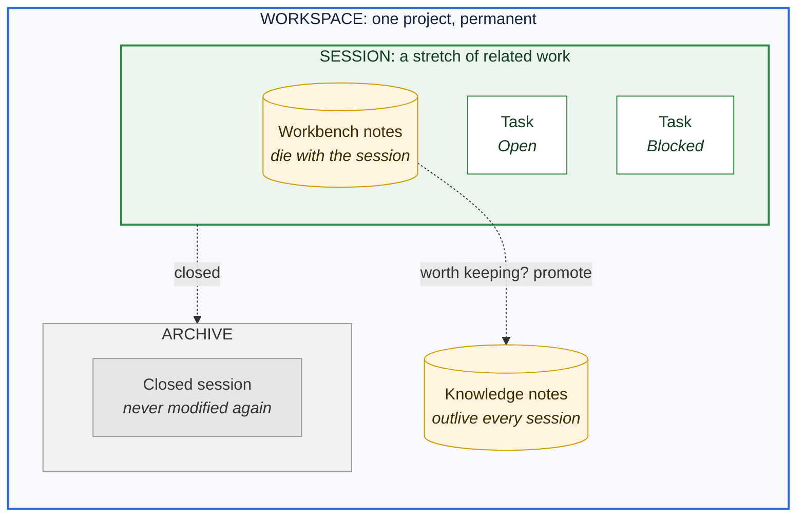
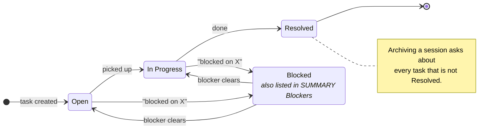

# Concepts

Five nouns carry the whole model. Learn these and everything else is detail.

| Concept | Scope | Lifetime | Answers |
|---------|-------|----------|---------|
| **Workspace** | One project | Permanent | *Where am I?* |
| **Session** | A stretch of related work | Weeks, then archived | *What are we working on?* |
| **Task** | One piece of that work | Days | *What's the state of this piece?* |
| **Knowledge note** | The workspace | Outlives every session | *What did we learn?* |
| **Workbench note** | One session | Dies with the session | *What am I thinking right now?* |

The distinction that matters most is the last two: **knowledge outlives, workbench does not.**

---

## Workspace

**One project.** Usually one repo, though nothing requires a repo: a research
project or a set of notes works fine.

The slug is resolved automatically, from the git remote where there is one
(`FredDsR-cortex`) or the directory name otherwise. You rarely type it. When two
different directories would resolve to the same slug, cortex stops and asks
rather than silently merging them.

A workspace holds sessions, an archive, and its knowledge notes. It is the
outermost container and it does not expire.

## Session

**A stretch of related work**, and the unit you actually start and finish.

A session groups tasks that belong together: a feature, a refactor, a spike, a
week of small fixes. It carries a `SUMMARY.md` with status, blockers, and notes,
and a `tasks/` directory holding the detail.

Sessions have two distinct endings, and confusing them causes real problems:

- **Closing the day** saves everything and signs off, but the session stays
  open. Tomorrow resumes exactly where you stopped.
- **Closing the session** is deliberate and final. It asks what to do with each
  unresolved task, then moves the whole thing to
  `archive/YYYY-MM-DD-<slug>/`, which is never modified afterward.

Several agents can work one workspace at once, each with its own session
pointer, so concurrent sessions do not collide.

## Task

**One piece of work inside a session**, with a status from a fixed vocabulary:

Nothing enforces these transitions: the four values are labels an agent writes,
not a state machine the code validates. The arrows show the usual path, not a
rule.

That list is fixed in `cortex/model.py`. There is deliberately **no "dropped" or
"won't do"** status. Work that gets abandoned is archived with its tasks still
`Open`, so the archive records what actually happened rather than claiming a
completion that never occurred.

Tasks can declare typed links to each other (`blocked_by`, `related_to`,
`follows`), which the viewer draws as typed edges. Blockers live in the session
summary; tasks point back at them.

## Knowledge note

**What you learned, kept past the work that taught you.**

Workspace-scoped, so every session in the project can reach it. This is the
right home for a gotcha, a decision and its reasoning, a convention the team
settled on, or a pointer to something external.

The test for whether something belongs here: *would this still be useful three
months from now, after this session is archived?* If yes, it is knowledge.

Each note carries a `description` in its frontmatter, and that one line is what
appears in the index and the graph, letting an agent judge relevance without
opening the file. It is the most load-bearing field in the format.

Notes link to each other with `[[wikilinks]]`. A link to a note that does not
exist yet is a **ghost**: the viewer still draws it, dashed and faded, so an
unwritten note stays visible instead of silently missing. Writing
`[[knowledge/retry-policy]]` before that note exists is a valid way to mark
something worth writing later.

## Workbench note

**Thinking in progress**, scoped to one session.

Drafts, spec and plan output, brainstorm results, notes-to-self. It lives in
`sessions/<slug>/workbench/` and stops mattering when the session closes.

Workbench is the low-stakes place to write. You do not have to decide whether
something is worth keeping forever before you write it down. When a workbench
note turns out to have lasting value, promote it to knowledge.

---

## Choosing between them

**Task or knowledge note?** A task is work to *do*; a knowledge note is
something to *remember*. "Fix the retry logic" is a task. "Retries must be
capped at 3 or the gateway rate-limits us" is knowledge.

**Workbench or knowledge?** Ask whether it survives the session. Scratch
thinking about how to structure a migration is workbench. The reason you chose
that structure is knowledge.

**New session or new task?** If it belongs to the work already in flight, it is
a task. If it is a different thread you would describe separately, start a
session. Sessions are cheap.
